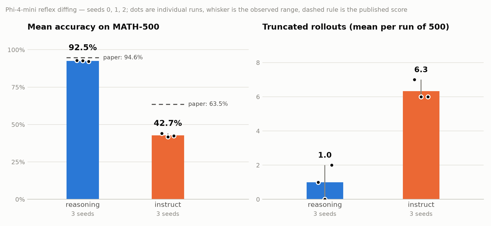

# 📓 Preliminary Results & Research Log — Reflex Diffing in Phi-4-mini
This is a living progress log of this project and my findings so far.

## Summary
I implemented the generation, and grading code and got started on the sentence level annotation.
Since I used a wrong parameter, I circled back to reproducing the baseline.

## Log

### July 20th:

**Baseline**:
- Question: How can I quickly and cheaply generate the rollouts necessary for this project?
   - Decision: Implement the generation using modal serverless H100 GPUs for this batch workload.
      - -> quick and easy generation (< 5min) for free within free-tier limits        
- Decision: Use the same generation parameters as in the technical report for consistency.    
- Implemented grading using math-verify, as in the Phi-4-mini reasoning technical report.
- Graded rollouts -> consistent with paper results for the reasoning model 
- Risk: Suspected that parsing failures are the problem 
    - tracked parsing failures and regraded -> not a problem

### July 21st:

**Multi-seed baseline**:
- Generated and graded on MATH 500 for three seeds for both models 

- Reasoning: 92.5% mean (92.2 / 92.6 / 92.8) vs. 94.6% in the paper -> close enough to call reproduced.
- Instruct: 42.7% mean (41.8 / 42.4 / 44.0) vs. 63.5% in the paper -> **~21 point gap that needs
  investigating** before the instruct rollouts can be used as a baseline.
    - low spread between seeds -> likely not the reason
    - potential reasons:
        - grading error (the correct solution is there, but is not extracted by the grader)
        - prompt template / chat formatting 
        - wrong sample temperature (accidentaly used 0.8 instead of 0.6 from the paper). 
